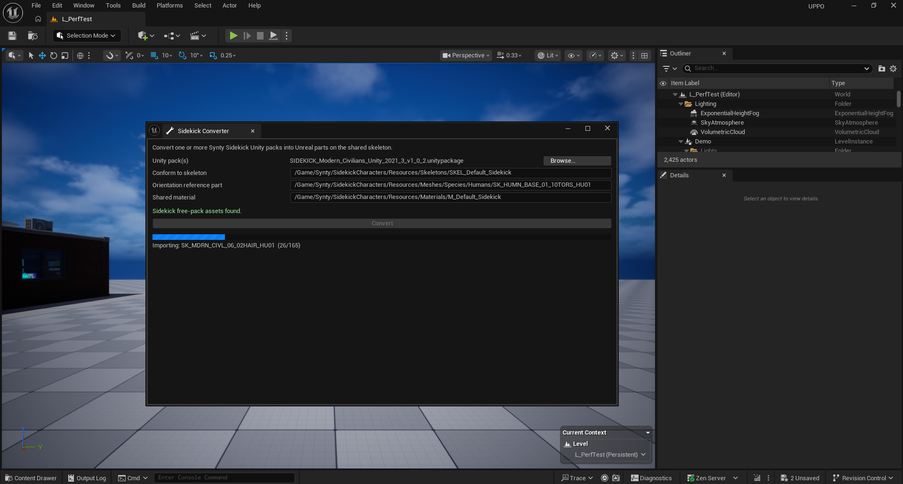
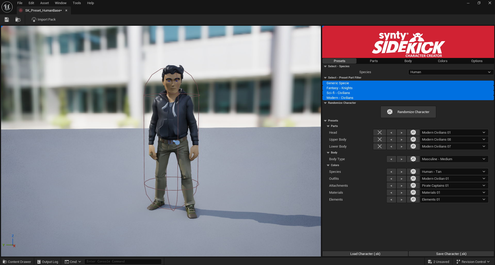

# Sidekick Converter

An Unreal Engine 5.7 editor plugin for Synty **Sidekick** packs that ship Unity-only.
It converts each part into a `USkeletalMesh` on the shared `SKEL_Default_Sidekick`
skeleton, keeping the dynamic cloth and hair bones and the body-shape morph targets, so
the part shows up in the Sidekick toolkit and merges at runtime like a part Synty shipped
for Unreal.

Point it at a pack's `.unitypackage`, click Convert, and the parts land in your project
ready to use.

**Video walkthrough:** https://youtu.be/g5A5BOZOPKc

## Why this exists

Synty releases some Sidekick packs (Modern Civilians, for example) as Unity packages
with no Unreal version, or with a long gap before the UE version ships. The Unity
package already contains the part `.fbx` files, so the meshes are there. Importing
them into Unreal by hand does not work.

Drag a pack's parts onto `SKEL_Default_Sidekick` and Unreal refuses:

> Failed to merge bones. This could happen if significant hierarchical changes have
> been made, e.g. inserting a bone between nodes.

The natural assumption is that Synty changed the body skeleton between the Unity and
Unreal versions. It did not. Across all 165 Modern Civilians outfit parts there is
zero body-bone reparenting.

## What actually goes wrong

Some parts (coats, capes, backpacks, long hair, shoulder pieces) carry extra leaf
bones named `*_dyn_*` (`abac_dyn_01`, `hair_dyn_03`, and so on). These are dynamic
jiggle bones hung off attach points so cloth can swing. They are real Synty content.

Two things break a hand import:

1. Different garments disagree on the shape of their dyn-bone chains, so pushing
   every part's dyn bones into one shared skeleton makes the second conflicting part
   trip the merge error.
2. The raw Unity rig orients several bones (the right-side chain, pelvis, feet, root)
   with a different roll or axis than the canonical skeleton the Sidekick animations
   are authored against. A part imported as-is binds to the skeleton but twists at
   those joints once an animation drives it.

## What the tool does

For each part it imports the mesh and morph targets only (no Unity materials), then
conforms it to the shared skeleton in-engine:

- The part's reference skeleton is rebuilt as the shared skeleton's canonical bones, in
  canonical order, each bone taking a reference part's rest transform. Every converted
  part then shares one identical skeleton, so they line up at the elbow, wrist, and every
  other joint instead of drifting apart when you assemble them.
- The part's own `*_dyn_*` bones are kept mesh-local and appended after the canonical
  bones. The shared skeleton itself is never grown, so dyn chains that conflict between
  parts never collide.
- Skin weights are remapped by bone name.
- The shared `M_Default_Sidekick` material is assigned, the one the toolkit recolors
  through its swatch system.

The conversion runs in a separate headless editor process. A live editor importing ~165
parts would render a thumbnail for each one and run the video memory dry, and it would
pop an import dialog per part. Headless skips both. The panel polls progress and shows a
single readout.

## Requirements

- Unreal Engine 5.7, C++ project (the plugin has a C++ module).
- The Synty Sidekick Character Tool installed in the project. Version 0.4.1 or newer applies a
  pack's colors without an editor restart; on older versions they fall back to a restart (see
  [Limitations](#limitations)).
- A Sidekick pack that includes the base resources (the free Starter pack does). The
  converter conforms onto, and reads its shared material from, these assets:
  - `/Game/Synty/SidekickCharacters/Resources/Skeletons/SKEL_Default_Sidekick`
  - `/Game/Synty/SidekickCharacters/Resources/Meshes/Species/Humans/SK_HUMN_BASE_01_10TORS_HU01`
  - `/Game/Synty/SidekickCharacters/Resources/Materials/M_Default_Sidekick`

If your install put those at different paths, the panel's path fields let you point at
them. The panel shows each dependency in green when it resolves, red when it does not.

The Python Editor Script Plugin is required and is enabled automatically as a plugin
dependency.

## Install

1. Download `SidekickConverter.zip` from the
   [Releases page](https://github.com/Tiny-Hawk/sidekick-converter/releases) and extract it.
2. Copy the extracted `SidekickConverter` folder into your project's `Plugins` directory
   (create `Plugins` if it isn't there).
3. Open the project and accept the prompt to rebuild the module, or build the editor target
   yourself. The build generates `Binaries` and `Intermediate`.

## Use

On a project's first conversion, open the Sidekick Character Tool and create at least one
preset before converting. That first use is what creates the toolkit's color database, which
the converter writes each pack's colors into. Parts always convert; colors only register once
that database exists.

1. **Tools → Sidekick Converter**.
2. Confirm the three dependency lines are green.
3. **Browse** to one or more pack `.unitypackage` files.
4. **Convert**. The panel reports extraction, then a live `part 15/165` count.
5. When it finishes, the parts and the pack's colors are in. **Show parts** jumps to the
   converted folder. (If the Sidekick Character Creator happened to be open during the convert,
   the colors are held; the panel offers Try Again, Restart Now, or Restart Later.)
6. Open the Sidekick toolkit; the pack's parts and colors are selectable.

Converted parts are written under
`/Game/Synty/SidekickCharacters/Resources/Meshes/Outfits/<PackName>/`.

## Colors

The converter pulls the pack's ColorMap atlases out of the Unity package, imports them, and
registers the pack's color schemes into the toolkit's database so they appear in the color
menu like an official pack's. The toolkit ships color schemes only for the few packs Synty
pre-loaded, so a Unity-only pack like Modern Civilians starts with none; the converter fills
that in.

A conversion writes the schemes into the database as soon as it finishes, so they show up in
the toolkit with no restart. The one case where that does not work is covered under
[Limitations](#limitations).

## Limitations

Colors are written into the Sidekick toolkit database when a conversion finishes, and appear
with no restart. The catch: the toolkit holds that database open while its own window is open.
If the Sidekick Character Creator is open during a conversion, the write is blocked; the panel
says so and offers **Try Again** (close the Creator first), **Restart Now**, or **Restart Later**
(the colors apply at the next editor startup). Parts and materials are in either way; only the
color-menu entries depend on the database being free.

Sidekick toolkit versions before 0.4.1 held the database open for the whole editor session, so on
those the colors always fall back to the restart path.

## License

See `LICENSE`.
